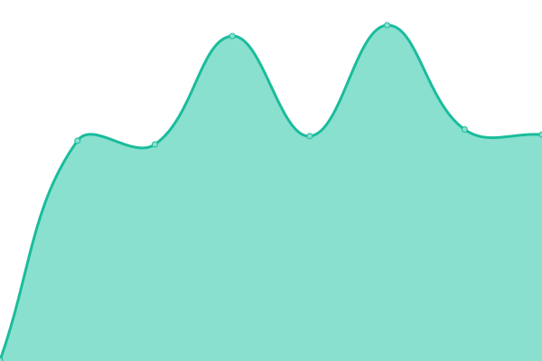

# [📈 Live Status](https://smc.github.io/upt): <!--live status--> **🟧 Partial outage**

This repository contains the open-source uptime monitor and status page for [Swathanthra Malayalam Computing](http://smc.org.in), powered by [Upptime](https://github.com/upptime/upptime).

With [Upptime](https://upptime.js.org), you can get your own unlimited and free uptime monitor and status page, powered entirely by a GitHub repository. We use [Issues](https://github.com/smc/upt/issues) as incident reports, [Actions](https://github.com/smc/upt/actions) as uptime monitors, and [Pages](https://smc.github.io/upt) for the status page.

<!--start: status pages-->
<!-- This summary is generated by Upptime (https://github.com/upptime/upptime) -->
<!-- Do not edit this manually, your changes will be overwritten -->
<!-- prettier-ignore -->
| URL | Status | History | Response Time | Uptime |
| --- | ------ | ------- | ------------- | ------ |
|  [SMC website](https://smc.org.in) | 🟩 Up | [smc-website.yml](https://github.com/smc/upt/commits/HEAD/history/smc-website.yml) | 

 216ms
     
 | 

<a href="https://up.smc.org.in/history/smc-website">100.00%</a>
    

|  [SMC blog](https://blog.smc.org.in) | 🟩 Up | [smc-blog.yml](https://github.com/smc/upt/commits/HEAD/history/smc-blog.yml) | 

 624ms
     
 | 

<a href="https://up.smc.org.in/history/smc-blog">100.00%</a>
    

|  [Indic Project](https://indicproject.org) | 🟥 Down | [indic-project.yml](https://github.com/smc/upt/commits/HEAD/history/indic-project.yml) | 

 594ms
     
 | 

<a href="https://up.smc.org.in/history/indic-project">0.00%</a>
    

|  [Indic Keyboard](https://indic.app) | 🟩 Up | [indic-keyboard.yml](https://github.com/smc/upt/commits/HEAD/history/indic-keyboard.yml) | 

 367ms
     
 | 

<a href="https://up.smc.org.in/history/indic-keyboard">99.74%</a>
    

|  [Wiki](https://wiki.smc.org.in) | 🟩 Up | [wiki.yml](https://github.com/smc/upt/commits/HEAD/history/wiki.yml) | 

 1299ms
     
 | 

<a href="https://up.smc.org.in/history/wiki">99.89%</a>
    

|  [Mailing List](http://lists.smc.org.in) | 🟩 Up | [mailing-list.yml](https://github.com/smc/upt/commits/HEAD/history/mailing-list.yml) | 

 276ms
     
 | 

<a href="https://up.smc.org.in/history/mailing-list">100.00%</a>
    

|  [LibIndic](https://libindic.org) | 🟩 Up | [lib-indic.yml](https://github.com/smc/upt/commits/HEAD/history/lib-indic.yml) | 

 515ms
     
 | 

<a href="https://up.smc.org.in/history/lib-indic">99.48%</a>
    

|  [Grandham](https://grandham.in) | 🟩 Up | [grandham.yml](https://github.com/smc/upt/commits/HEAD/history/grandham.yml) | 

 814ms
     
 | 

<a href="https://up.smc.org.in/history/grandham">99.76%</a>
    

|  [Poorna](https://poorna.smc.org.in) | 🟩 Up | [poorna.yml](https://github.com/smc/upt/commits/HEAD/history/poorna.yml) | 

 548ms
     
 | 

<a href="https://up.smc.org.in/history/poorna">100.00%</a>
    

|  [Swanalekha](https://swanalekha.smc.org.in) | 🟩 Up | [swanalekha.yml](https://github.com/smc/upt/commits/HEAD/history/swanalekha.yml) | 

 430ms
     
 | 

<a href="https://up.smc.org.in/history/swanalekha">100.00%</a>
    

|  [Community](https://community.smc.org.in) | 🟩 Up | [community.yml](https://github.com/smc/upt/commits/HEAD/history/community.yml) | 

 667ms
     
 | 

<a href="https://up.smc.org.in/history/community">100.00%</a>
    

|  [Morphology Analyser](https://morph.smc.org.in) | 🟩 Up | [morphology-analyser.yml](https://github.com/smc/upt/commits/HEAD/history/morphology-analyser.yml) | 

 601ms
     
 | 

<a href="https://up.smc.org.in/history/morphology-analyser">100.00%</a>
    

|  [Varnam API](https://varnam-status.smc.org.in/status) | 🟩 Up | [varnam-api.yml](https://github.com/smc/upt/commits/HEAD/history/varnam-api.yml) | 

 779ms
     
 | 

<a href="https://up.smc.org.in/history/varnam-api">100.00%</a>
    

|  [Handwriting](https://handwriting.smc.org.in) | 🟩 Up | [handwriting.yml](https://github.com/smc/upt/commits/HEAD/history/handwriting.yml) | 

 347ms
     
 | 

<a href="https://up.smc.org.in/history/handwriting">100.00%</a>
    

|  [Malayalam Speech Corpus](https://msc.smc.org.in) | 🟩 Up | [malayalam-speech-corpus.yml](https://github.com/smc/upt/commits/HEAD/history/malayalam-speech-corpus.yml) | 

 368ms
     
 | 

<a href="https://up.smc.org.in/history/malayalam-speech-corpus">100.00%</a>
    

|  [Malayalam Phonetic Analyser](https://phon.smc.org.in) | 🟩 Up | [malayalam-phonetic-analyser.yml](https://github.com/smc/upt/commits/HEAD/history/malayalam-phonetic-analyser.yml) | 

 458ms
     
 | 

<a href="https://up.smc.org.in/history/malayalam-phonetic-analyser">100.00%</a>
    

|  [Optical Character Recognition](https://ocr.smc.org.in) | 🟩 Up | [optical-character-recognition.yml](https://github.com/smc/upt/commits/HEAD/history/optical-character-recognition.yml) | 

 168ms
     
 | 

<a href="https://up.smc.org.in/history/optical-character-recognition">100.00%</a>
    

|  [Releases](https://releases.smc.org.in) | 🟩 Up | [releases.yml](https://github.com/smc/upt/commits/HEAD/history/releases.yml) | 

 463ms
     
 | 

<a href="https://up.smc.org.in/history/releases">100.00%</a>
    

|  [English-Malayalam Machine Translation](https://translate.smc.org.in) | 🟩 Up | [english-malayalam-machine-translation.yml](https://github.com/smc/upt/commits/HEAD/history/english-malayalam-machine-translation.yml) | 

 333ms
     
 | 

<a href="https://up.smc.org.in/history/english-malayalam-machine-translation">100.00%</a>
    

<!--end: status pages-->

[**Visit our status website →**](https://smc.github.io/upt)

## 📄 License

- Powered by: [Upptime](https://github.com/upptime/upptime)
- Code: [MIT](./LICENSE) © [Swathanthra Malayalam Computing](http://smc.org.in)
- Data in the `./history` directory: [Open Database License](https://opendatacommons.org/licenses/odbl/1-0/)
